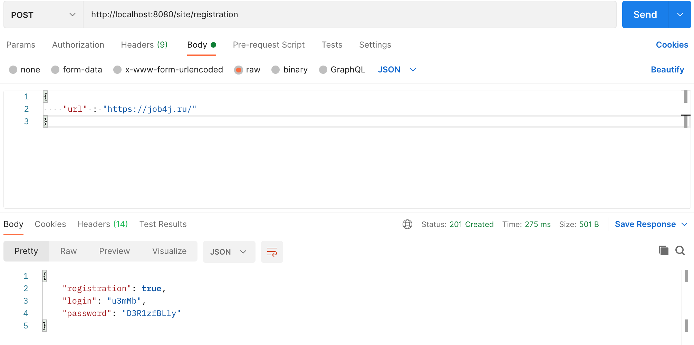
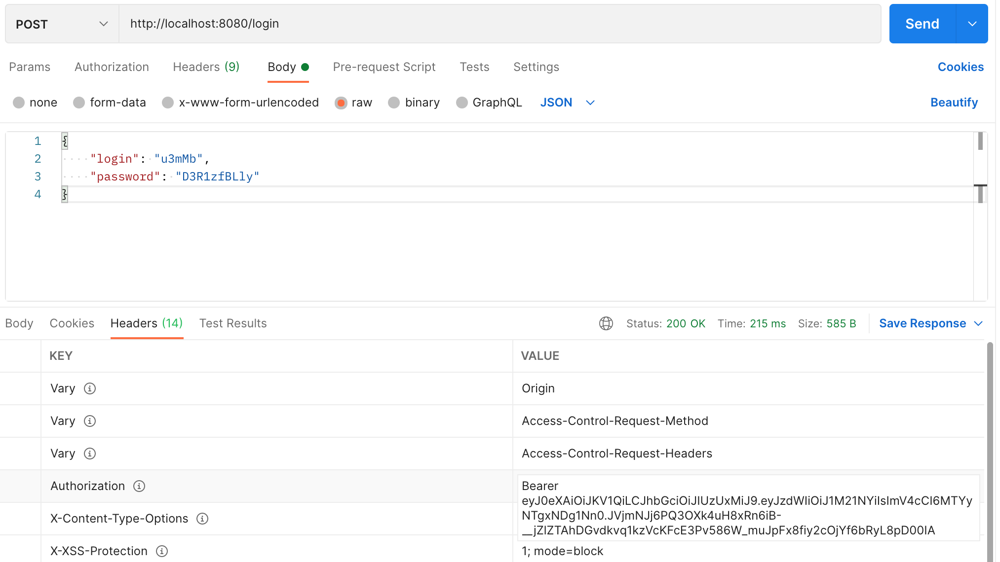
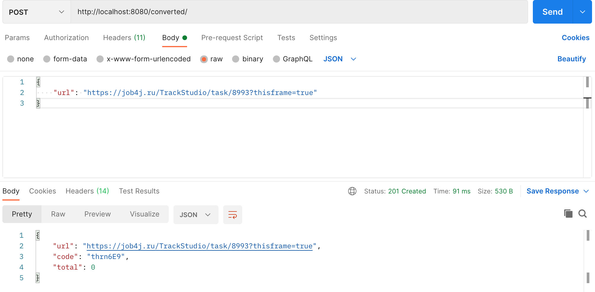
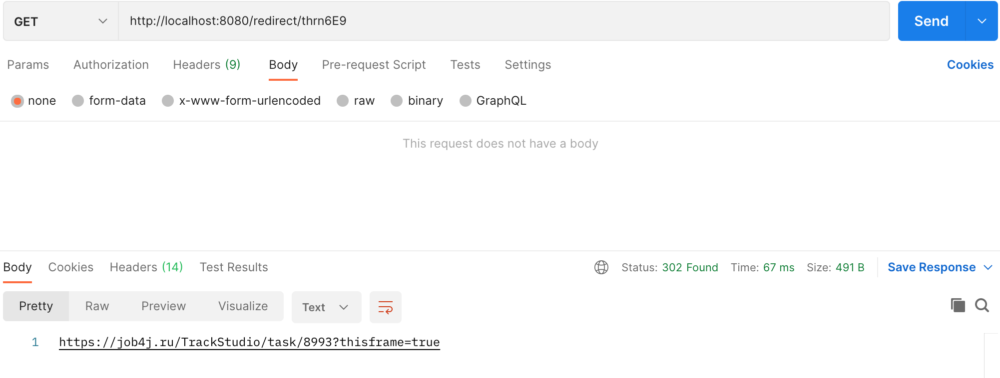

## Проект курса [job4j](http://job4j.ru)

1. При регистрации сайта выдается сгенерированные логин и пароль.
2. С помощью их авторизуетесь. 
3. Теперь можно получить ссылку, по которой будет переадрисация на ваш сайт.
4. Можно получить статистику количества вызовов сайта. 

Технологии:
- PostgresSQL
- CRUDRepository
- Spring Boot / Security / Data / Rest
- Log4j
- JUnit / Mockito
- MVC / Singleton (On Demand Holder Idom)

Регистрация сайта http://localhost:8080/site/registration

Авторизуетесь http://localhost:8080/login

Конвертируется ссылка на ваш сайт http://localhost:8080/converted/

Переадрисация по выданной ссылке http://localhost:8080/redirect/{code}

Статисктика по вашему сайту http://localhost:8080/statistic/
